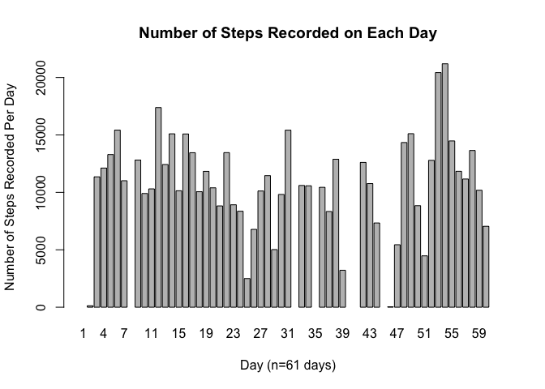
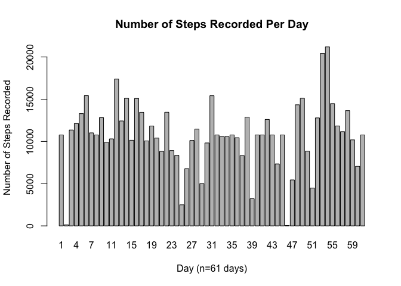
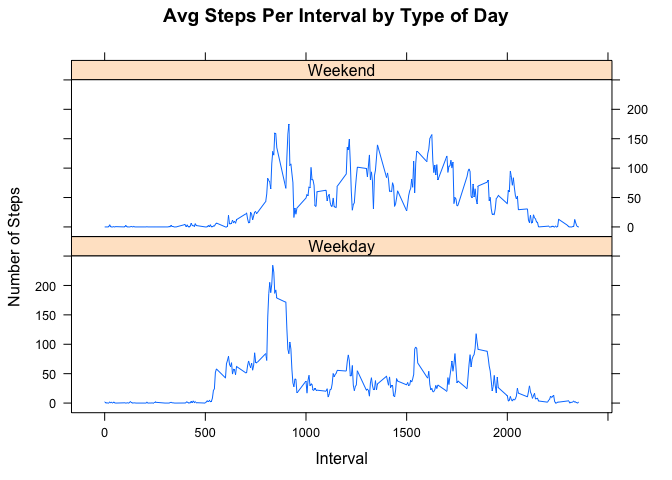

# Reproducible Research: Peer Assessment 1


## Loading and preprocessing the data
We start by reading the data into R from the 'activity.csv' file in our data directory

```r
data <- read.csv("./data/activity.csv",header = TRUE)
```
Next, we coerse the dates in the 'date' column to Date types.

```r
data$date <- as.Date(data$date,format = "%Y-%m-%d")
```
## What is mean total number of steps taken per day?
First we calculate the total number of steps taken each day.

```r
step_sums<-with(data,tapply(steps,date,sum,na.rm = FALSE))
```
We plot the histogram of the total number of steps taken per day.

```r
barplot(step_sums,ylab="Number of Steps Recorded Per Day"
        ,xlab="Day (n=61 days)",names.arg = 1:61
        ,main="Number of Steps Recorded on Each Day")
```

 
  
Finally, we calculate the mean and median number of steps taken in a single day.

```r
mean(step_sums,na.rm=TRUE)
```

```
## [1] 10766
```

```r
median(step_sums,na.rm=TRUE)
```

```
## [1] 10765
```
## What is the average daily activity pattern?
First we calculate the mean number of steps taken in each time interval.

```r
interval_avg <- with(data,tapply(steps,interval,mean,na.rm = TRUE))
```
Next, we plot these means as a time series plot using the base plotting system.

```r
plot(unique(data$interval),interval_avg,type="l",xlab="Interval (5 min)"
     ,ylab="Average Steps Recorded",main="Average Daily Activity Pattern")
```

 
  
In order to determine during which interval, on average, the most steps were
recorded, we create a matrix with two columns: one the contains the identifying
number for each interval, and the second the contains the mean number of steps
taken during that interval across all days measured. Finally, we subset the
matrix to return the interval with the most steps on average. 

```r
mean_activity <- cbind(unique(data$interval),interval_avg)
colnames(mean_activity) <- c("Interval","Avg Steps")
mean_activity[mean_activity[,2]==max(mean_activity[,2]),]
```

```
##  Interval Avg Steps 
##     835.0     206.2
```
It turns out that the interval recorded at 8:35 recorded the most steps on
average. 
## Imputing missing values
To remove the missing data from the dataset, we will replace each NA in the
steps column with the mean for that 5 minute interval.  
  
Our first step is to copy the data set. After copying the dataset, we step
through each row. If the step count is NA in a specific day and interval, we
insert the avg number of steps for that interval, otherwise we copy the recorded
number of steps from the original dataset.

```r
data2 <- data
for(i in 1:length(data$steps)){
    if(is.na(data[i,1])){
        data2[i,1] <- mean_activity[mean_activity[,1]==data[i,3],2]
    }
}
```
Let's see how this effected the total number of steps recorded on each day. We
can answer this question by calculating a vector of total recorded steps for
each day and then displaying this data as a histogram. The following code will
do this for us:  

```r
step_sums2<-with(data2,tapply(steps,date,sum,na.rm = FALSE))
barplot(step_sums2,xlab="Day (n=61 days)",names.arg = 1:61
        ,main="Number of Steps Recorded Per Day"
        ,ylab="Number of Steps Recorded")  
```

 
  
There are clearly differences in this new histogram compared to the original
histogram. Most notably, there are days that did not have any registered step
data originally that are now showing the average number of daily steps. Have we
changed the mean or median values of the data by replacing the missing values?
Let's take a look at the values in our new dataset 'data2':  

```r
mean(step_sums2,na.rm=TRUE)
```

```
## [1] 10766
```

```r
median(step_sums2,na.rm=TRUE)  
```

```
## [1] 10766
```
Everything looks good. We have slightly increased the median value from 10765
previously to 10766 in our new dataset, but this change probably not large
to have any deleterious effect on our analysis, so we'll accept it. The mean
value is unchanged.  
  
## Are there differences in activity patterns between weekdays and weekends?
First we need to determine, for each day, wether it is a weekday or a weekend.
First, weuse the 'weekdays()' function to create a vector of day names. Next,
we cast these day names to either "weekday" or "weekend" depending on whether
the day name is in the set ("Saturday","Sunday") (i.e. if it is a weekend or
weekday). Finally, we append this factor to our datasets.  

```r
wkdy <- weekdays(data[,2])
wkdy[!(wkdy %in% c("Saturday","Sunday"))] <- "weekday"
wkdy[(wkdy %in% c("Saturday","Sunday"))] <- "weekend"
data<-cbind(data,wkdy)
data2<-cbind(data2,wkdy)
```
Since we're interested in plotting the average steps in each interval separated
by type of day, we'll transform the data to compute the mean number of steps for
both weekdays and weekends. We use the 'melt()' function from the reshape
library to transform the two columns of means to a sigle column of means with a
new factor column with two levels "Weekday" and "Weekend".

```r
interval_avg_wkdy <- with(data
                          ,tapply(steps,list(interval,wkdy),mean,na.rm = TRUE))
interval_avg_wkdy <- as.data.frame(
    cbind(as.numeric(row.names(interval_avg_wkdy)),interval_avg_wkdy))
colnames(interval_avg_wkdy) <- c("interval","Weekday","Weekend")
library(reshape)
interval_avg_wkdy <-melt(interval_avg_wkdy,id=c("interval"))
colnames(interval_avg_wkdy) <- c("interval","day_type","steps")
```
Finally, using the lattice plotting system, we plot the time series of steps
separately for each level of 'day_type'.

```r
library(lattice)
xyplot(steps~interval|day_type,data=interval_avg_wkdy,type="l"
       ,xlab="Interval",ylab="Number of Steps",layout=c(1,2)
       ,main="Avg Steps Per Interval by Type of Day")
```

 
